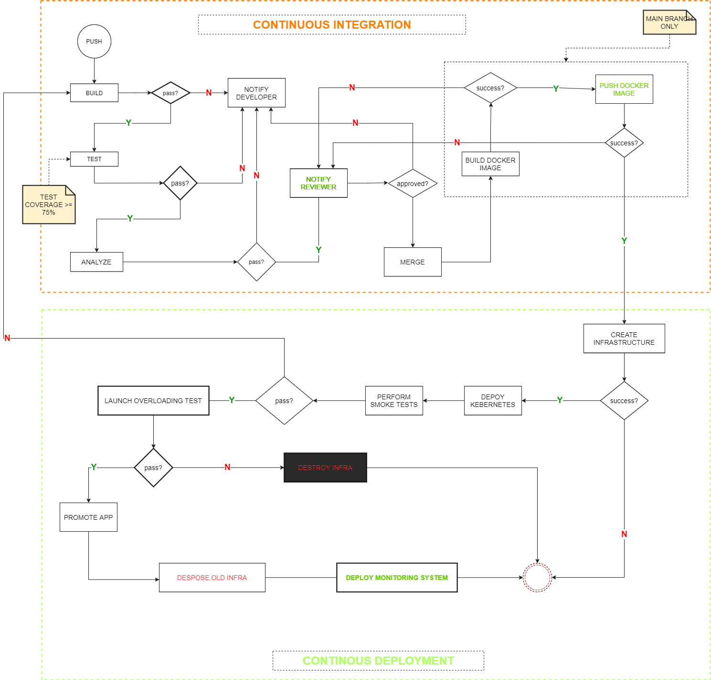

## The Open Heath Care Services API

**OHCS API** is a community and opensource project for the delivery of API for free essential health care  services through digital technologies. We aim at provisioning Microservices and development server to support  worldwide adoption of eHealth specifically for essential health care.

The core concepts of the microservices archetecture are practitioners, beneficiaries, caregivers, appointments, schedules, consultations, healthrecords, treatment plans, heath report, membership registries,  medical knowledge, notifications, donation, prediction and diagnosis. The project development adopts staging strategy aiming at incremental development process through **Continuous Delivery**.

The simplest microservices to be implemented through the API are categorized based on the stakeholders' core needs:

| Operations                   | Practitioner(doctor) | Care Giver | Beneficiary (patient) | Donor | Administrator |
| ---------------------------- | :------------------: | :--------: | :-------------------: | :---: | :-----------: |
| Find practitioners           |                     |     *     |           *           |       |               |
| Make appointment             |                     |     *     |           *           |       |               |
| Create profile               |          *          |     *     |           *           |       |       *       |
| Place availability schedules |          *          |           |                       |       |               |
| Share medical knowledge      |          *          |           |                       |       |               |
| Search medical knowledge     |                     |     *     |           *           |       |               |
| Produce health report        |          *          |           |                       |       |               |
| Send notifications           |          *          |           |                       |       |       *       |
| Make donations               |                     |           |                       |   *   |               |
| Elaborate treatment plans    |          *          |           |                       |       |               |
| etc.                         |                     |           |                       |       |               |

Find details on operations, entities, objects and API paths designed to conform with [OpenAPI Specification](https://swagger.io/specification/) **`3.0.1`** in this [folder](./swagger) (`swagger`).  Also, the API is distributed through [Docker Container Image](https://hub.docker.com/repository/docker/devopsxpro/ohcs) available in a public docker repository.

### Architectural requirements

The API is developed with Flask micro-framework and related third-party packages and libraries. We use `waitress` package to execute in production server and `flasgger` to provide the Swagger User Interface based of the API documentation as per OpenAPI 3.0.x Specification. The continuous integration process (e.g. build, test, analysis) is executed through third-party packages such as: `pytest` `coverage` `pylint`  `flask-migrate` and more found the `requirements.txt` file.

### The Continuous Delivery Pipeline

The continuous delivery pipeline is handled through CircleCI, and parallet actions are handled through Github Workflow Actions as found in the configuration folders `.circleci` and `.github` respectively. The continuous deployment process is executed through AWS cloud services, helping in the provision of the Infrastructure as Code, namely:

* AWS CloudFormation
* Elastic Containers Service
* VPC - Virtual Private Cloud
* Load balancers
* Relational Database Service (RDS)
* EC2 Security Groups
* Elastic Cloud Computer (EC2)

#### Continuous Integration Process
