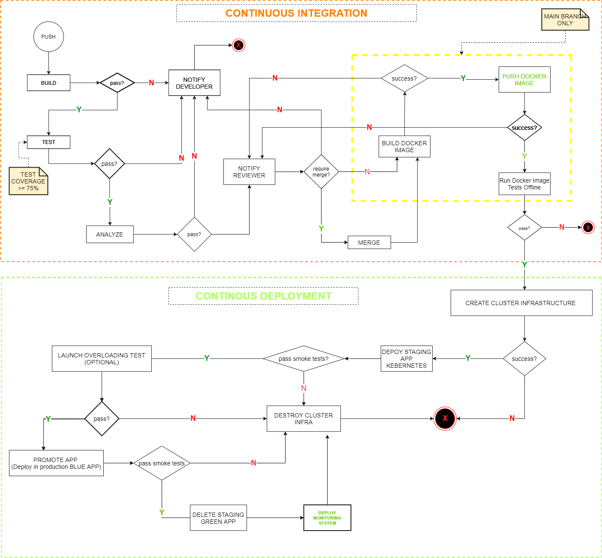

## The Open Heath Care Services API [[]]()

**OHCS API** is a community and opensource project for the delivery of API for essential health care  services through digital technologies. It aims at provisioning Microservices and development server to support  worldwide adoption of eHealth specifically for essential health care.

The core concepts of the microservices archetecture are practitioners, beneficiaries, caregivers, appointments, schedules, consultations, healthrecords, treatment plans, heath report, membership registries,  medical knowledge, notifications, donation, prediction and diagnosis. The project is incrementally developed and deployed adopting blue and green **Continuous Delivery**. The CI/CD Pipeline is deployed in CircleCi.

The simplest microservices to be implemented through the API are categorized based on the stakeholders' core needs:

| Operations                   | Practitioner(doctor) | Care Giver | Beneficiary (patient) | Donor | Administrator | etc. |
| ---------------------------- | :------------------: | :--------: | :-------------------: | :---: | :-----------: | ---- |
| Find practitioners           |                     |     *     |           *           |       |               |      |
| Make appointment             |                     |     *     |           *           |       |               |      |
| Create profile               |          *          |     *     |           *           |       |       *       |      |
| Place availability schedules |          *          |           |                       |       |               |      |
| Share medical knowledge      |          *          |           |                       |       |               |      |
| Search medical knowledge     |                     |     *     |           *           |       |               |      |
| Produce health report        |          *          |           |                       |       |               |      |
| Send notifications           |          *          |           |                       |       |       *       |      |
| Make donations               |                     |           |                       |   *   |               |      |
| Elaborate treatment plans    |          *          |           |                       |       |               |      |
| etc.                         |                     |           |                       |       |               |      |

Find details on operations, entities, objects and API paths designed to conform with [OpenAPI Specification](https://swagger.io/specification/) **`3.0.1`** in this [folder](./openhcs/swagger) (`swagger`).  Also, the API is distributed through [Docker Container Image](https://hub.docker.com/repository/docker/devopsxpro/ohcs) available in a public docker repository.

### Prerequisites

The API is developed with Flask micro-framework and related third-party libraries. We use `waitress` library to run in production server and `flasgger` to provide the Swagger User Interface based of the API documentation as per OpenAPI 3.0.x Specification. The continuous integration process (e.g. build, test, analysis) is executed through third-party packages such as: `pytest`, `coverage` , `pylint`,  `flask-migrate` and more found the `requirements.txt` file.

#### Infrastracture Requirements

The infrastructure for deployment is provisioned through `AWS CloudFormation` Plastform as Service. Here we create the following resources in the context of `Infrastructure as Code`:

* EKS - Elastic Kubernetes Service
* VPC - Virtual Private Cloud
* Subnets - Subnetworks
* ELB - Elastic Load balancers
* RDS- Relational Database Service (RDS)
* EC2 Security Groups
* EC2 - Elastic Cloud Computer (EC2)
* NAT - Network Address Translator
* RT - Route tables
* IAM Roles
* IAM Policies
* CloudWatch
* Route Rule
* Internet Gateways
* Elastic IP

### The Continuous Delivery Pipeline

The continuous delivery pipeline is handled through CircleCI, and parallet actions are handled through Github Workflow Actions as found in the configuration folders `.circleci` and `.github` respectively.

#### Continuous Integration Process (CI)

It start with build (e.g.` code lint`, `dockerfile lint` ) step for every push event on the repository `main ` branch or related branches. It proceeds with `coverage tests` on code and `datatabases` migrations. The `code analysis` step aim at scanning the code and implemented libraries for security vulnerabilities ( but not impletend yet, the workflow). Code built and passing the tests and analysis steps is reviewed to proceed with the `code merge` (if a pull request is received). The operation are executed as per the `Makefile` in this repository.

###### CI Utilities and Configuration files

* `Makefile` - for virtual environment setup and all - dependencies installation, lint, test, migrations operation
* `.pylintrc` - python lint INI configurations for `pylint` library
* `.coveragerc `-  caverage tests INI configurations for `coverage and pytest libraries.`

#### Continous Deployment Process (CD)

While the docker image is built and pushed to Docker hub repository and successfully tested by the product engineer (offline), an approval is emitted to proceed with CD steps. Starting from cluster infrastruture provision (IaC), followed by kubernetes deployments - first with `staging as green deployment`. When the deployed apps in `stagging envirornment` pass `smoke test` , then in `prodution blue` app is deployed (i.e. Promoted ). Also, with the app deployed in production environment (in blue) we perform `smoke tests`, then the staging app is deleted when the smoke tests succeed. Hence, we didn't implement the monitory step yet.

###### CI/CD Pipeline Authentication Requirements

* Docker Hub Id and Password
* AWS Access Key Id and Secret Access Key
* AWS RDS Database Instance Credentials

###### CD Utilities and Templates

* [deployments scripts](./.circleci/deployment/K8s) ( `deploy-init.sh`) - helper to make kubernetes deployments
* [services scripts](./.circleci/deployment/K8s) ( `services-init.sh` ) - helper to create the kubernetes services
* [secrets scripts](./.circleci/deployment/K8s) ( `secrets-init.sh` ) - helper to create the kubernetes secrets
* [configmaps scripts](./.circleci/deployment/K8s) ( `configs-init.sh` ) helper to create kubernetes config maps
* [stacks deleting scripts](./.circleci/deployment/IaC):
  * `delete-alb-instances.sh` -  helper to delete loadbalancers
  * `delete-cluster-nodes.sh` - helper to delete the workload nodes
  * `delete-network-resources.sh `- helper to delete the cluster communication network stack resources
* Templates - found in `.circleci/deployment ` directory:
  * For AWS cloudformation (folder `./IaC`):

    * `clusterIaC.yml` - AWS cloudformation template to help provision the cluster and cluster network infrastructure
    * `clusterCore.yml` - AWS cloudformation template to help provision cluster workload nodes
  * For Kubernetes ( folder `./K8s`)

    * `deployments.yml ` - Kubernetes template for app deployment.
    * `secrets.yml ` - kubernetes template for app secrets creation
    * `configmaps.yml ` - Kubernetes template for app configmaps
    * `services.yml ` - Kubernetes template for app services creation

### Application Source Code

The application source code and test case files are found in the folder named, `./openhcs` . This application will be available shortly, running in the `PythonEveryWhere Platform.`
